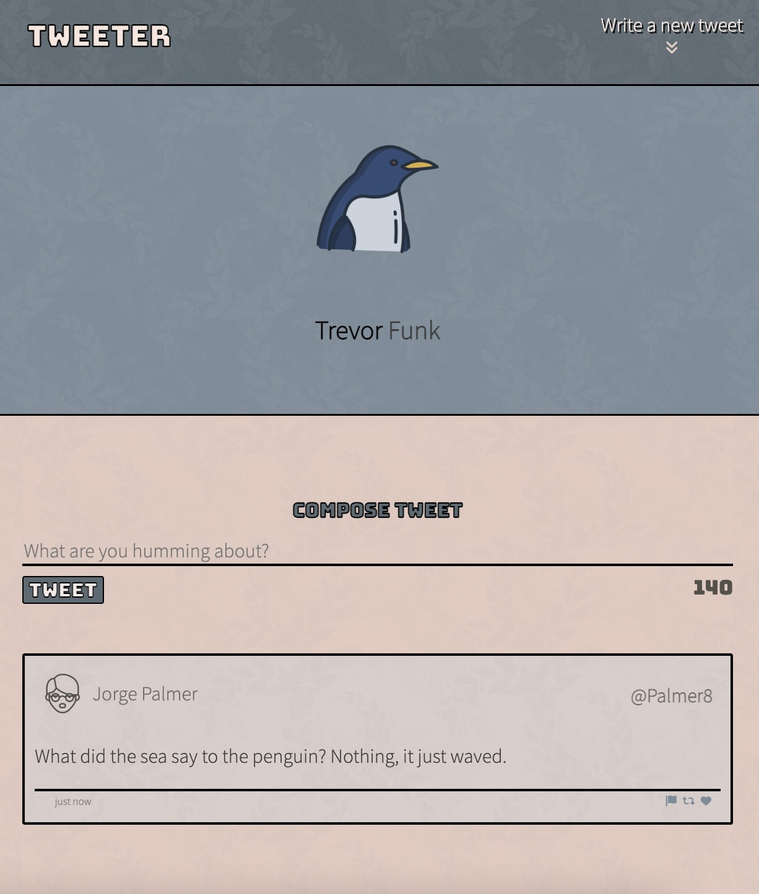
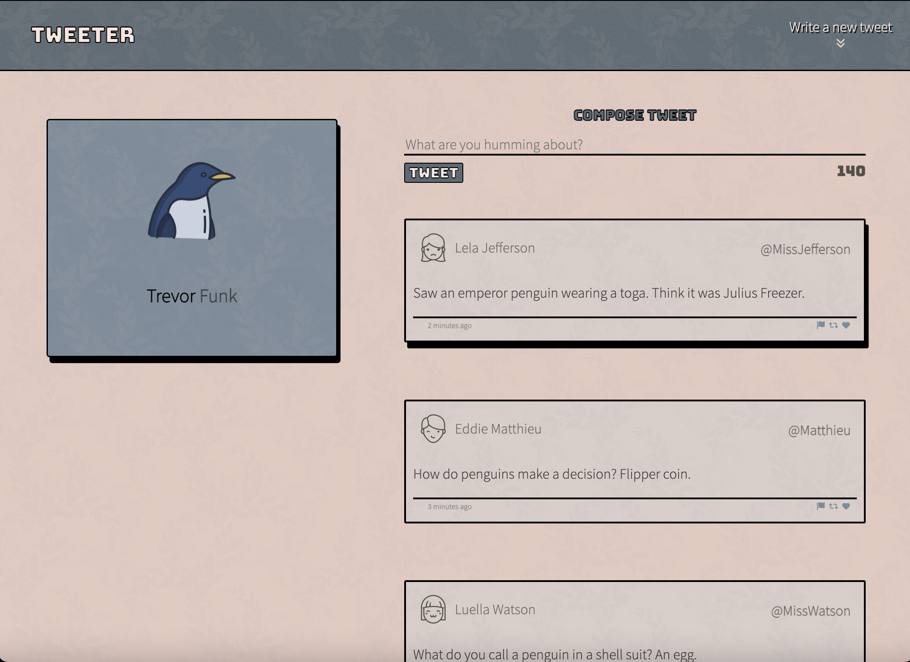
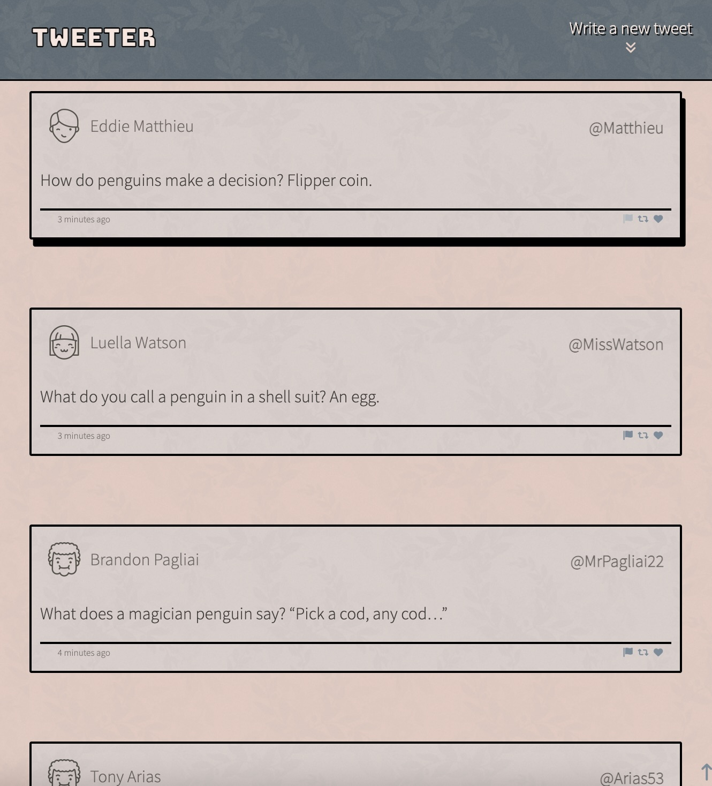
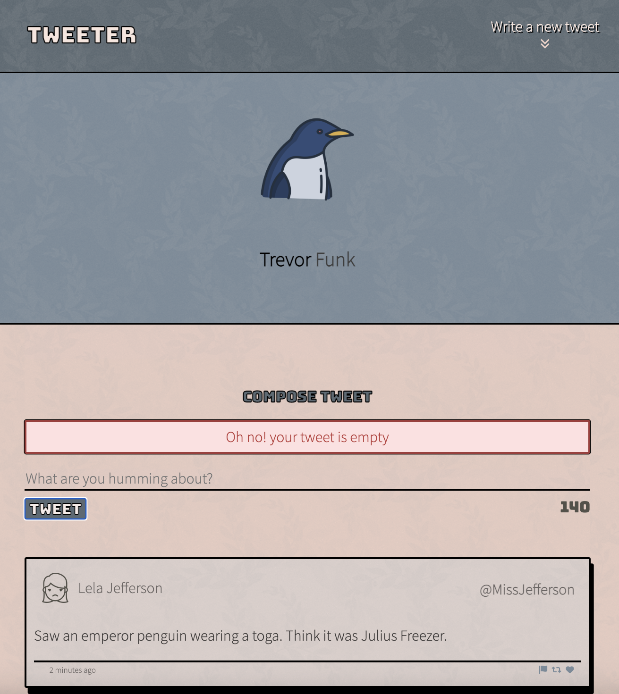

# Tweeter Project

Tweeter is a simple, single-page Twitter clone.

# Project Stack

- HTML, CSS, JS, jQuery and AJAX on the client-side
- Node and Express on the server-side

# Project Features

- tweets post without refreshing page
- tweets are posted in descending order
- character counter for tweets with warnings for too long or empty tweets
- toggle button for when user creates a new tweet 
- fading toggle button appearing when scrolling down brings the user back to top of the page

## <u> Final Product </u>

  
 
  
  

## Getting Started

1. [Create](https://docs.github.com/en/repositories/creating-and-managing-repositories/creating-a-repository-from-a-template) a new repository using this repository as a template.
2. Clone your repository onto your local device.
3. Install dependencies using the `npm install` command.
3. Start the web server using the `npm run local` command. The app will be served at <http://localhost:8080/>.
4. Go to <http://localhost:8080/> in your browser.

## Dependencies

- Express
- Node 5.10.x or above
- Body-parser
- chance
- md5

### Dev Dependencies

- nodemon

